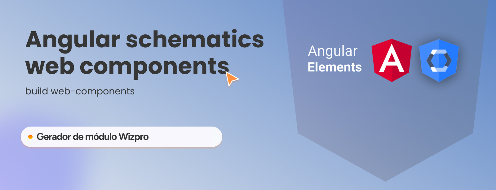

# angular schematics web components
Este é um *Schematic* para gerar um projeto com *Web Components* utilizando o *Angular*.

___


___ 

IMPORTANTE: Este esquema supõe que você está usando uma aplicação com o padrão da Wiz. Caso não esteja, será necessário alterar algumas informações.

## Como usar
Execute o comando no seu terminal. 

```bash
ng g @wizco/schematics-webcomponents:webcomponents NOME -p ELEMENTO_TAG
```
> Substitua o parâmetro NOME e ELEMENTO_TAG pelo valor de sua escolha.

| Parâmetro | Descrição | exemplo | | 
| --- | --- | --- | --- |
| NOME | Nome do projeto | usuarios | projects/usuarios |
| ELEMENTO_TAG | Nome do elemento | usuarios | `<wc-usuarios-modules></wc-usuarios-modules>` | 

___


___ 

## O que é gerado
O esquema irá gerar um projeto com a seguinte estrutura:

```bash
├── src/
│   ├── projects/
│   │   ├── NOME/
```

O pacote também ira adiciona os  scripts para build em produção e staging.

````json
scripts: {
  "build:web-component": "ng build --project NOME --single-bundle --output-hashing none  --aot --build-optimizer",
  "build:web-component:staging": "ng build --configuration=staging --project NOME --single-bundle --output-hashing none  --aot --build-optimizer"
}
````


Os scripts podem ser executados com os seguintes comandos:
  
```bash 
# Produção
npm run build:web-component

# Homologação
npm run build:web-component:staging
```
